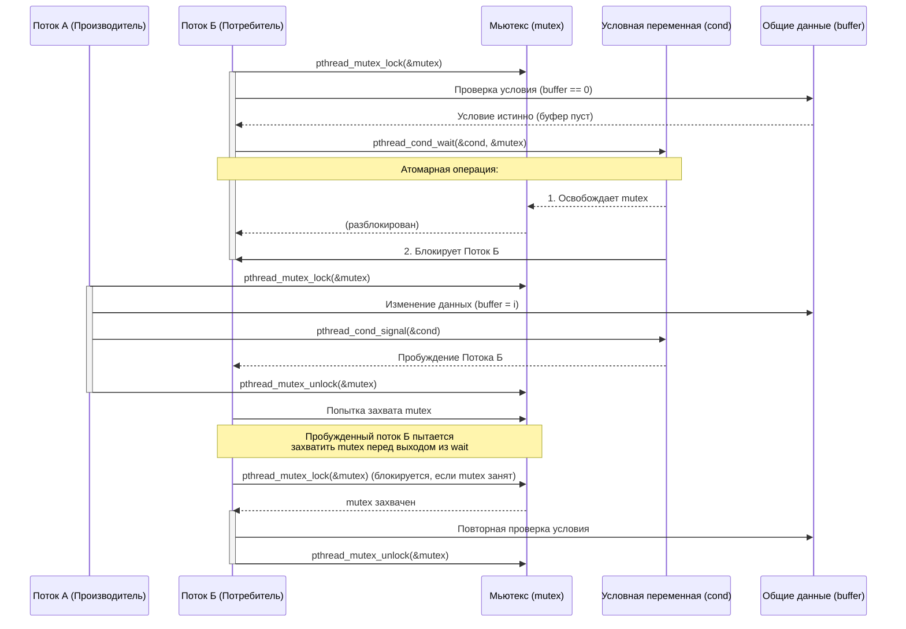

---

---
---
* [[Синхронизация (User Space)|Назад]]
- [[Условные переменные (Condition Variables)]]
---
Условные переменные — это примитив синхронизации, предназначенный для блокировки потока до наступления определенного условия, связанного с данными, защищенными мьютексом . Их ключевая особенность — атомарная операция освобождения мьютекса и перевода потока в состояние ожидания.

### 1. Фундаментальный принцип: Связка с мьютексом

Условная переменная никогда не используется сама по себе, а всегда в паре с мьютексом. Эта связка критически важна для предотвращения состояния гонки (race condition) между проверкой условия и переходом потока в режим ожидания .

Рассмотрим классическую диаграмму, демонстрирующую взаимодействие потоков через условную переменную:

Главная "магия" заключается в функции `pthread_cond_wait`. Как видно на диаграмме, поток, вызвавший эту функцию, должен заранее захватить мьютекс. Затем `pthread_cond_wait` выполняет две операции атомарно :

1. Освобождает захваченный мьютекс.
    
2. Переводит вызывающий поток в состояние ожидания на данной условной переменной.
    

Атомарность этих двух действий гарантирует, что никакой другой поток не сможет "вклиниться" и изменить состояние данных между моментом освобождения мьютекса и моментом, когда поток будет официально помечен как ожидающий. Если бы мьютекс освобождался до перехода в режим ожидания, существовало бы окно, в котором другой поток мог бы изменить условие и отправить сигнал, но первый поток еще не начал бы ожидать, что привело бы к потере сигнала и вечной блокировке .

### 2. Низкоуровневая реализация в Linux: Футексы (Futexes)

В современных ядрах Linux условные переменные (как и другие примитивы синхронизации из библиотеки `NPTL`) реализованы поверх механизма **футексов (fast userspace mutexes)** .

Футекс — это ядерный примитив, который позволяет блокировать поток, ожидая изменения значения 32-битной переменной в пользовательском пространстве. Логика работы `pthread_cond_wait` на основе футекса выглядит следующим образом:

1. **Проверка в Userspace:** Поток, владея мьютексом, проверяет предикат (например, `buffer == 0`). Если условие не выполнено, поток готовится к блокировке.
    
2. **Подготовка:** Поток атомарно изменяет состояние футекса, ассоциированного с условной переменной, сигнализируя о наличии ожидающего.
    
3. **Системный вызов:** Поток выполняет системный вызов `futex` с операцией `FUTEX_WAIT` (или её вариациями для PI). Важнейший нюанс: ядро перед блокировкой выполняет атомарную проверку: **значение футекса по адресу `uaddr` всё ещё равно ожидаемому?** . Если за время между шагом 2 и шагом 3 другой поток изменил значение (например, отправил сигнал), ядро не будет блокировать поток и вернет ошибку `EAGAIN`, заставляя поток перепроверить условие. Это и есть механизм предотвращения потерянных пробуждений.
    
4. **Блокировка:** Если проверка прошла, ядро переводит поток в состояние ожидания (`TASK_INTERRUPTIBLE` или `TASK_UNINTERRUPTIBLE`) и помещает его в очередь ожидания, связанную с данным футексом. Мьютекс к этому моменту уже освобожден (на шаге 2 в userspace, до входа в ядро, или как часть атомарной операции в ядре, в зависимости от конкретной реализации).
    

### 3. Ключевые операции

- **`pthread_cond_wait(cond, mutex)`**:
    
    - **Вход:** Поток должен быть владельцем `mutex`.
        
    - **Действие:** Атомарно освобождает `mutex` и блокирует поток до получения сигнала по `cond` .
        
    - **Выход:** После получения сигнала и перед возвратом из функции поток автоматически и атомарно **повторно захватывает `mutex`** . Это означает, что после возврата из `pthread_cond_wait` поток снова владеет мьютексом. Именно это свойство объясняет необходимость цикла `while` вокруг `pthread_cond_wait` (см. ниже).
        
- **`pthread_cond_signal(cond)`**:
    
    - **Действие:** Пробуждает как минимум один поток, ожидающий на данной условной переменной. Нет гарантии, какой именно поток будет разбужен (например, с высшим приоритетом — не гарантируется) . Пробужденный поток становится кандидатом на выполнение.
        
    - **Важное замечание:** Хотя в примерах часто показывают вызов `signal` до освобождения мьютекса, в реальности нет строгих требований к этому. Однако, держать мьютекс захваченным во время вызова `signal` может привести к лишним переключениям контекста: пробужденный поток тут же попытается захватить мьютекс, но обнаружит, что он занят, и снова уйдет в сон .
        
- **`pthread_cond_broadcast(cond)`**:
    
    - **Действие:** Пробуждает **все** потоки, ожидающие на данной условной переменной . Используется, когда изменение состояния делает возможным продолжение работы для нескольких потребителей одновременно.
        

### 4. Критически важный паттерн: "Spurious Wakeups" и цикл `while`

Код с использованием условных переменных всегда обрамляется в цикл `while`, а не в `if` . Это связано с двумя факторами:

1. **Ложные пробуждения (Spurious Wakeups):** Реализация (как в ядре, так и в пользовательских библиотеках) допускает ситуацию, когда поток может выйти из состояния ожидания на условной переменной **без** получения соответствующего сигнала `signal` или `broadcast` .
    
2. **Инвариантность условия:** Даже если пробуждение было вызвано сигналом, нет гарантии, что условие, которого ждал поток, всё ещё истинно. К моменту, когда поток получит процессорное время и захватит мьютекс, другой поток мог уже перехватить ресурс или изменить состояние.
    

Поэтому корректный паттерн использования всегда таков:

c

pthread_mutex_lock(&mutex);
while (проверка_условия_ложна) {
    pthread_cond_wait(&cond, &mutex);
}
// Здесь условие истинно, и мьютекс снова захвачен
/* ... выполнить действия ... */
pthread_mutex_unlock(&mutex);

### 5. Реализация в ядре: `struct cv` и `cv_wait`

В ядре Linux (и других UNIX-подобных ОС, например FreeBSD/NetBSD) используется похожий механизм, но с другими именами функций . Например, в ядре NetBSD:

- `cv_init()`, `cv_destroy()` для управления объектом условной переменной.
    
- `cv_wait(struct cv *cvp, kmutex_t *mtx)`: Работает идентично `pthread_cond_wait`. Переданный мьютекс `mtx` должен быть захвачен. Функция атомарно освобождает его и блокирует поток .
    
- `cv_signal()` и `cv_broadcast()` для пробуждения.
    
- Существуют таймаутные версии: `cv_timedwait()`, `cv_wait_sig()` (ожидание, прерываемое сигналом) .
    

В ядре условные переменные используются для синхронизации доступа к ограниченным ресурсам (например, ожидание памяти) или завершения операций ввода-вывода .

### Резюме

Условная переменная — это высокоуровневый механизм синхронизации, построенный над мьютексами. Её ключевая особенность — способность **атомарно освободить мьютекс и перевести поток в состояние ожидания**. В Linux реализация базируется на футексах, что позволяет минимизировать количество переходов в ядро. Корректное использование всегда подразумевает повторную проверку условия в цикле для защиты от ложных пробуждений и состояний гонки.